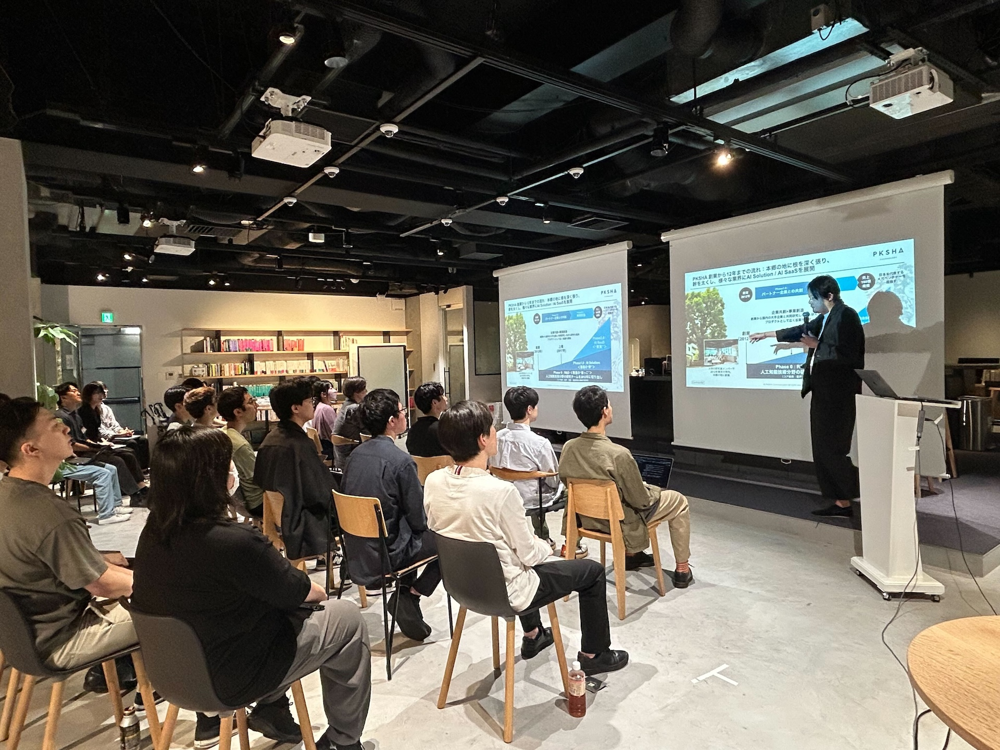
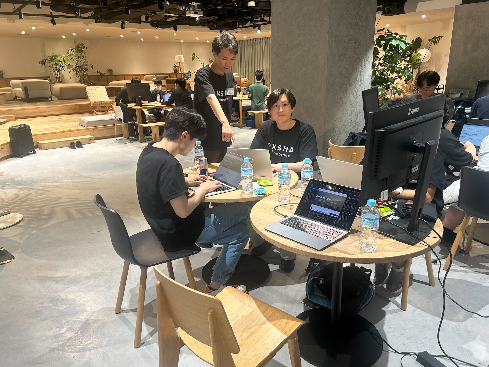
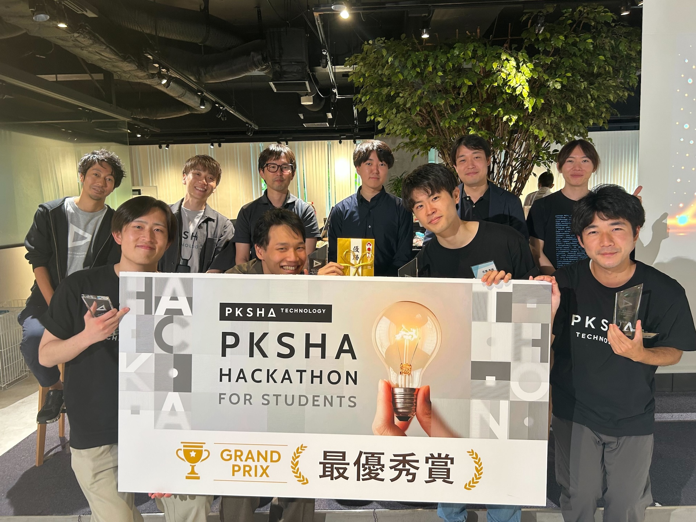

import { SlideViewer } from '@/components/slide-viewer';

2025年6月11日から13日にかけて開催された「PKSHA HACKATHON 2025｜AIエージェント開発ハッカソン」にSWEとして参加し、開発した旅行プランAIエージェント「norun」で幸運にも最優秀賞をいただくことができました。

この記録は、結果そのものよりも、その裏にあったチームでの試行錯誤や、ハッカソンならではの困難、そして得られた深い学びに焦点を当てた活動の記録です。

## 1. 開催概要

- **イベント名**: PKSHA HACKATHON 2025｜AIエージェント開発ハッカソン
- **開催期間**: 2025年6月11日〜13日
- **結果**: 最優秀賞

## 2. 開発プロダクト「norun」

### コンセプトの原点
今回のアイデアソンでは、Biz担当のメンバーが持ってきてくれた「旅行プランの自動化」というアイデアを元に議論が始まりました。

チームでは僕以外の3人が旅行好きでしたが、共通して「プランを立てるのは面倒」という課題を持っていました。一方、僕は「旅行は別に好きではないけど、誰かが全部セットしてくれて、金額も分かっていて、ただついていくだけなら行くかも。そして、実際行ってみると案外楽しんで帰ってくる」というタイプ。この一見バラバラな意見から、私たちのプロダクトが解決すべき課題が見えてきました。

現状の旅行には、両極端な2つの選択肢しかありません：

| | 旅行代理店 | 個人手配 |
|:---:|:---:|:---:|
| 値段 | 高価 | **安価** |
| 柔軟性 | 画一的 | **自由度が高い** |
| 手間 | **楽** | 面倒 |
| 安心感 | **安心** | 不安 |

私たちが目指したのは、この**中間領域**です。

**「楽で、安くて、自分に最適な旅をしたい」**

この潜在的なニーズと、多くの人が抱える「無駄だとわかっていても、何もせず過ごしてしまう土日」という課題を解決できると確信し、開発をスタートしました。

### プロダクト概要
`norun`は、ユーザーの曖昧な入力からでも具体的な旅行プランを提案し、最終的には予約までをシームレスに行うことを目指したAIエージェントです。

ファクトチェックとユーザー体験の向上に重きを置き、Google Map上にある現実の観光名所を提案し、天候や季節、経路まで考慮した「現実に旅をすることができる」プランニングを実現しました。

### デモ動画
<video 
  controls 
  style={{ aspectRatio: '16 / 9', width: '100%', borderRadius: '8px', margin: '2em 0' }}
>
  <source src="./videos/norun-demo.mp4" type="video/mp4" />
  <source src="./videos/norun-demo.webm" type="video/webm" />
  お使いのブラウザは動画の再生に対応していません。
</video>

### プレゼンテーションスライド
<SlideViewer images={[
  './images/slides/01.png',
  './images/slides/02.png',
  './images/slides/03.png',
  './images/slides/04.png',
  './images/slides/05.png',
  './images/slides/06.png',
  './images/slides/07.png',
  './images/slides/08.png',
  './images/slides/09.png',
  './images/slides/10.png',
  './images/slides/11.png',
  './images/slides/12.png',
  './images/slides/13.png',
  './images/slides/14.png',
  './images/slides/15.png',
  './images/slides/16.png',
  './images/slides/17.png',
  './images/slides/18.png',
  './images/slides/19.png',
]} />

## 3. 技術スタック（計画と現実）

開発で利用、または利用を試みた技術スタックです。

- **フロントエンド**: Next.js
- **バックエンド**: Next.js (API Routes)
- **インフラ**: Vercel
- **LLM**: OpenAI API (ChatGPT)
- **外部API**:
  - Google Maps API
- **認証**: Firebase Authentication
  - ※当初はデータベースとしても活用予定でしたが、開発が間に合わなかったためログイン認証にのみ使用しました。
- **(利用を断念した技術)**
  - **楽天トラベルAPI**: 予約機能の実装を試みましたが、APIの仕様（法人格が必要）により断念。また、検証段階で無料枠の上限に達し、最終的にはホテルの検索が不安定になりました。
  - **Web Search API**: 最新版でJSON形式の出力が用意されておらず、今回の開発には適さないと判断し、使用しませんでした。

## 4. チーム「TOKM」

個人参加で出会った4名でチームを結成。チーム名は、ハッカソンのためにメンバーがそれぞれ集結した場所（**東京、大阪、神戸、宮城**）の頭文字と、AIの文脈における最小単位「Token」をかけて`TOKM`と名付けました。

- **AE (AIエンジニア)**: チームの潤滑油的な存在。LLMの専門知識を活かし、必要なAPIを率先して開発。
- **SWE (ソフトウェアエンジニア)**: ハッカソン全体のメタ認知やプロダクト構成の問題提起など、チームに不可欠な役回りを担当。
- **Biz (ビジネス)**: 市場調査を行い、プロダクトの価値を証明する材料を収集。
- **自分 (SWE)**: 人生2回目のハッカソン。前回の後悔から「チームのムードメーカーになること」「開発のパワーの一つになること」を目標に参加。

## 5. 開発の舞台裏と学び

### 徹夜中のサーバーダウン
発表前日から朝にかけて徹夜で開発していた午前4時ごろ、世界的なサーバーダウンが発生し、AIコーディング支援ツールが一切使えなくなるという絶望的な事態に陥りました。ですが、そこで誰も諦めず、互いに励まし合いながら、自分たちでコードを解読したり、プレゼンスライドのブラッシュアップに時間を切り替えたりと、チームで冷静に乗り越えることができました。

### AIエージェント開発ならではの困難
今回の開発で最も苦労したのは、AIがコードを生成する開発スタイルそのものでした。共同開発かつ時間がなかったため、ファイル分割する余裕がなく、結果として**1ファイルが3000行ぐらい**に。これにより、AIの出力の精度によってはバグが生まれやすくなったり、**せっかく機能していた機能を、他のエージェントが知らず知らずのうちに殺してしまう**という意図しない機能の上書きが頻発しました。

### 得られた学び：技術、そして哲学
この経験から、技術的には「**必ず形にすること**」「**重要な要件を見定めること**」「**走り始める前にエンドポイント設計を徹底すること**」の重要性を痛感しました。

同時に、より大きな学びは「**自分の欲しいものではなく、本当に必要とされているものは何か**」を突き詰めるプロセスそのものでした。

ハッカソン後、PKSHAの創業者の方とお話しする機会をいただき、そこで「人の欲求は、他人の欲求の模倣なのではないか」という考え方を教えていただきました。自分の内から湧き出る純粋な欲求は存在せず、外部からのデータ入力でそれは常に変わっていく。だとすれば、限定的な個人の欲求を満たすよりも、社会の真の課題を客観的に捉え、他者が満足する姿を見る方が、結果として効率的に欲求を満たせる――。この視点は、今後のプロダクト開発において、自分の中核となる考え方になりました。

## 6. 結果とこれから

ありがたいことに最優秀賞という評価をいただくことができました。これは、単に技術的な新規性だけでなく、**現状の市場が抱える課題を的確に捉え、その解決策としてのビジネス的な将来性**を評価していただけたからだと感じています。チームで未来を妄想し、ユーザーの潜在的なニーズに深く向き合った結果が、このような評価に繋がったのだとすれば、これ以上嬉しいことはありません。

今後は、今回実装しきれなかった機能の実現を目指したいです。
- **予約機能とデータベース連携**の実装
- 旅の思い出をAIと共有し、提案を**パーソナライズ**する機能
- アカウント連携による**グループへの自動提案機能**

このハッカソンは、技術的な挑戦以上に、チームで一つの目標に向かうことの素晴らしさと、プロダクトを通して社会と向き合うことの面白さを教えてくれる、非常に濃密な体験でした。